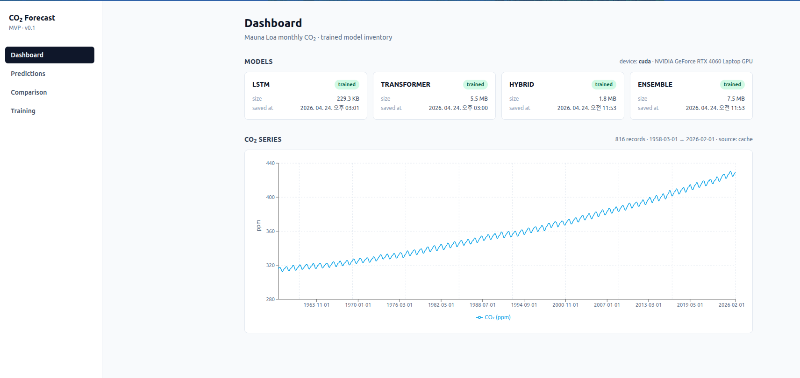

# CO2 Forecast — PyTorch × FastAPI × React

NOAA Mauna Loa 월별 CO2 데이터를 사용해 **LSTM / Transformer / Hybrid / Ensemble** 딥러닝 모델을 학습·평가·예측하는 풀스택 애플리케이션입니다.



- **Core**: PyTorch 2.x — 데이터 파이프라인, 모델, 학습, 평가
- **Backend**: FastAPI + SSE — 학습 잡 큐, 추론 캐시, 데이터셋 캐시
- **Frontend**: React 18 + Vite + Tailwind + Recharts — 대시보드·예측·비교·학습 UI

> 아키텍처 전체 구조와 UML은 [`docs/architecture.md`](docs/architecture.md), [`docs/uml.md`](docs/uml.md)를 참고하세요.

---

## 주요 기능

- **4종 모델**: LSTM, Transformer, LSTM+Transformer Hybrid, 학습 가능한 가중치 Ensemble
- **자동 데이터 파이프라인**: NOAA CO2 자동 다운로드 → 디스크 캐시, yoy_diff / detrend / lag / seasonal 피처
- **웹 UI 학습**: 브라우저에서 모델 선택 + 하이퍼파라미터 override → 실시간 SSE 진행률 스트림
- **모델 비교**: 여러 모델을 한 번에 평가하고 R² 기준 최적 모델 자동 선택
- **단일 포트 배포**: 프로덕션 빌드 시 Vite 산출물을 FastAPI가 함께 서빙 (`:8000`)
- **OpenAPI → TypeScript 타입 자동 생성**: 프론트·백엔드 스키마 드리프트 방지

---

## 프로젝트 구조

```
CO2_forecast_pytorch/
├── backend/
│   ├── app.py                  # FastAPI 엔트리포인트 (+ CORS, SPA fallback)
│   ├── main.py                 # CLI (--mode train|evaluate|all)
│   ├── configs/config.yaml     # 모델·학습·경로 설정
│   ├── requirements.txt
│   ├── api/
│   │   ├── config.py           # YAML 로더 (lru_cache)
│   │   ├── schemas.py          # Pydantic I/O
│   │   ├── state.py            # JobRegistry + TrainingJob + SSE queue
│   │   └── routers/            # datasets · models · predictions · evaluations · training
│   ├── services/
│   │   ├── dataset_cache.py    # NOAA 다운로드 + .data_cache/co2_mm_mlo.csv
│   │   ├── model_registry.py   # 체크포인트 discovery + device info
│   │   ├── inference_service.py# LRU(1) 모델 캐시 + predict()
│   │   └── training_service.py # ThreadPool(1) + progress callback → SSE
│   ├── src/                    # Pure PyTorch core
│   │   ├── data/data_loader.py
│   │   ├── models/models.py
│   │   ├── training/{trainer.py, metrics.py}
│   │   ├── evaluation/evaluator.py
│   │   └── utils/visualization.py
│   ├── tests/                  # pytest smoke tests (FastAPI TestClient)
│   ├── models/                 # *.pth 체크포인트 (자동 생성)
│   ├── plots/                  # 저장된 플롯 (자동 생성)
│   └── static/                 # Vite 빌드 산출물 (make build-frontend)
│
├── frontend/
│   ├── package.json            # React 18, Recharts, React Router, Tailwind
│   ├── vite.config.ts          # :5173 dev + /api → :8000 proxy + outDir=../backend/static
│   └── src/
│       ├── App.tsx             # BrowserRouter + lazy routes
│       ├── pages/              # Dashboard · Predictions · Comparison · Training
│       ├── components/         # layout · charts(TimeSeriesChart) · ui(MetricsStrip, ModelSelect)
│       ├── hooks/useSSE.ts     # EventSource wrapper
│       └── api/                # client.ts (fetch) + schema.d.ts (openapi-typescript)
│
├── docs/
│   ├── architecture.md         # 시스템 아키텍처
│   └── uml.md                  # Mermaid UML (class · sequence · component · state)
│
├── Makefile                    # dev-backend · dev-frontend · build · serve · test · types
├── README.md
└── LICENSE
```

---

## 빠른 시작

### 전제 조건

- Python 3.9+ (권장: conda env `py39_pt`)
- Node.js 18.18+ / npm 10+
- (선택) CUDA 지원 GPU — 없으면 자동으로 CPU 사용

### 1. 설치

```bash
# 백엔드
make install-backend
# 또는: pip install -r backend/requirements.txt

# 프론트엔드
make install-frontend
# 또는: cd frontend && npm install
```

### 2. 개발 모드 — 두 프로세스

```bash
# 터미널 1 — FastAPI :8000 (auto-reload)
make dev-backend

# 터미널 2 — Vite :5173 (/api → :8000 프록시)
make dev-frontend
```

브라우저에서 `http://localhost:5173` 접속.

### 3. 프로덕션 모드 — 단일 포트

```bash
make serve
# Vite 빌드 → backend/static/ → FastAPI가 SPA + API를 :8000에서 함께 서빙
```

### 4. CLI 모드 (웹 UI 없이)

```bash
cd backend

# 전체 모델 학습 + 평가
python main.py --mode all

# 특정 모델만
python main.py --mode train --model lstm
python main.py --mode evaluate --model ensemble

# 커스텀 설정 파일
python main.py --config configs/my_config.yaml
```

---

## API 요약

| 메서드 | 경로 | 설명 |
|---|---|---|
| `GET` | `/api/health` | 헬스 체크 |
| `GET` | `/api/datasets/co2?force_refresh=false` | NOAA CO2 전체 시계열 |
| `GET` | `/api/models` | 체크포인트 목록 + 디바이스 정보 |
| `POST` | `/api/predictions` | 단일 모델 테스트셋 예측 |
| `POST` | `/api/evaluations` | 다모델 비교 + R² 최적 모델 |
| `POST` | `/api/training/jobs` | 학습 잡 생성 (202, 큐잉) |
| `GET` | `/api/training/jobs[/{id}]` | 잡 목록 / 스냅샷 |
| `DELETE` | `/api/training/jobs/{id}` | 잡 취소 (다음 에폭 경계) |
| `GET` | `/api/training/jobs/{id}/events` | SSE 스트림 (`log` · `progress` · `completed` · `error` · `done` · `heartbeat`) |

서버 실행 중 `http://127.0.0.1:8000/docs`에서 Swagger UI 확인.

### TypeScript 타입 동기화

```bash
make types
# backend openapi.json을 덤프 → frontend/src/api/schema.d.ts 재생성
```

---

## 설정 (`backend/configs/config.yaml`)

핵심 섹션:

```yaml
data:
  url: "https://gml.noaa.gov/webdata/ccgg/trends/co2/co2_mm_mlo.txt"
  sequence_length: 24      # 입력 시퀀스 (월)
  forecast_horizon: 12     # 예측 지평 (월)
  train_ratio: 0.8
  val_ratio:   0.1
  test_ratio:  0.1

preprocessing:
  normalize: true
  detrend: false           # detrend ⊥ yoy_diff (상호 배타)
  yoy_diff: true
  add_seasonal_features: true
  add_lag_features: true
  lag_periods: [1, 12, 24]

models:
  lstm:        { input_size: 9, hidden_size: 64, num_layers: 2, dropout: 0.2 }
  transformer: { d_model: 64, nhead: 8, num_layers: 4, dropout: 0.1 }
  hybrid:      { lstm_hidden: 32, transformer_d_model: 32, transformer_layers: 2, fusion_hidden: 64 }

training:
  batch_size: 32
  learning_rate: 0.001
  epochs: 200
  patience: 20
  weight_decay: 0.00001
  scheduler: "ReduceLROnPlateau"
  scheduler_patience: 10
  scheduler_factor: 0.5

ensemble:
  models: ["lstm", "transformer", "hybrid"]
  weights: [0.3, 0.3, 0.4]  # 학습 가능

paths:
  model_dir: "models"
  log_dir:   "logs"
  plot_dir:  "plots"
```

학습 잡 생성 시 `overrides`로 `epochs · learning_rate · batch_size · patience · weight_decay`를 1회성 덮어쓸 수 있습니다 (웹 UI 폼 또는 API 요청 바디).

---

## 모델 개요

| 모델 | 구조 | 입력 → 출력 | 활용 |
|---|---|---|---|
| **LSTM** | LSTM × 2 → Dense | `(B, 24, 9) → (B, 12)` | 순차적 의존성이 강한 패턴 |
| **Transformer** | InputProj → PosEnc → EncoderLayer × 4 → Dense | 〃 | 장기 의존성, 복잡한 패턴 |
| **Hybrid** | [LSTM] ⊕ [Transformer] → Fusion MLP | 〃 | 두 특성 결합 |
| **Ensemble** | 3모델 stack → softmax(weights) 가중합 | 〃 | 프로덕션 견고성 |

전부 `backend/src/models/models.py` 한 파일에 정의. 새 모델 추가는 클래스 작성 + `create_model` 팩토리 한 줄 등록 + `configs/config.yaml` 섹션 추가로 끝납니다.

---

## 데이터 & 피처

- **원천**: NOAA GML Mauna Loa (1958-03 ~ 현재, 월별 ppm)
- **캐시**: `backend/.data_cache/co2_mm_mlo.csv` — 최초 1회 다운로드 후 재사용 (`?force_refresh=true`로 강제 갱신)
- **피처 (총 9개)**: `co2`, `month`, `month_sin`, `month_cos`, `trend`, `trend_normalized`, `co2_lag_{1,12,24}`
- **타겟 변환**: `yoy_diff`(12개월 차분) 또는 `detrend`(다항 추세 잔차) — 추론 시 자동 역변환으로 원단위 복원

---

## 관측 & 제약

- **단일 학습 워커**: `ThreadPoolExecutor(max_workers=1)` — GPU 메모리 경합 방지 및 SSE 로그 직렬화.
- **추론 모델 캐시**: 크기 1 LRU — 다른 모델 요청 시 이전 모델 해제.
- **학습 ↔ 추론 격리**: 학습 시작 시 `inference_service.unload_all()`이 자동 호출.
- **JobRegistry 휘발성**: 프로세스 메모리에만 존재. 재시작 시 잡 히스토리 유실 (MVP 의도).
- **취소**: `cancel_event` 플래그를 Trainer 루프가 에폭 경계에서 체크.

---

## 테스트

```bash
make test-backend
# backend/ 에서 pytest — FastAPI TestClient 기반 smoke 테스트
```

현재 커버리지: 헬스/모델 목록/데이터셋/학습 잡 라이프사이클 (2 에폭).

---

## 평가 지표

`backend/src/training/metrics.py` 기준 — 학습 콜백과 `/api/predictions` 응답에 동일 포맷으로 포함.

| 지표 | 의미 |
|---|---|
| **MSE / RMSE** | 평균 (제곱근) 제곱 오차 |
| **MAE** | 평균 절대 오차 — 이상치에 상대적으로 둔감 |
| **MAPE** | 평균 절대 백분율 오차 (%) |
| **R²** | 결정계수 — 1에 가까울수록 좋음 |

---

## 의존성

**Backend (주요)**

```
torch >= 2.0      fastapi 0.115        uvicorn[standard]
numpy  >= 1.21    sse-starlette 2.1    pydantic >= 2.7
pandas >= 1.3     scikit-learn >= 1.0  statsmodels >= 0.13
matplotlib · seaborn · plotly · tqdm · pyyaml · requests
```

**Frontend (주요)**

```
react 18.3        react-router-dom 6    recharts 2.15
vite 5.4          typescript 5.5        tailwindcss 3.4
openapi-typescript 7.4  (schema.d.ts 생성)
```

---

## 문제 해결

| 증상 | 조치 |
|---|---|
| `CUDA out of memory` | `config.yaml`에서 `batch_size` 축소 또는 CPU 사용 |
| NOAA 다운로드 실패 | `.data_cache/co2_mm_mlo.csv`를 수동 배치하거나 네트워크 확인 |
| SSE가 연결만 되고 이벤트 없음 | 서버 reverse proxy에서 응답 버퍼링 비활성화 필요 (`X-Accel-Buffering: no` 등) |
| 프론트 타입 오류 | `make types`로 schema 재생성 후 `npm run build` |
| 모델 로드 실패 `checkpoint not found` | `python main.py --mode train --model <name>` 또는 UI에서 학습 먼저 |

---

## 개발 체크리스트

- 새 엔드포인트 추가 → `backend/api/routers/*.py` + `schemas.py` → `make types` → 프론트 사용
- 새 모델 추가 → `src/models/models.py`에 클래스 + `create_model`에 분기 + `config.yaml.models` + `KNOWN_MODELS`(`services/model_registry.py`)
- 새 피처 추가 → `src/data/data_loader.py::create_features` + `models.lstm.input_size` 갱신

---

## 라이선스

[LICENSE](LICENSE) 파일 참조.

## 참고 자료

- [PyTorch 공식 문서](https://pytorch.org/docs/stable/index.html)
- [NOAA CO2 데이터](https://gml.noaa.gov/ccgg/trends/)
- [FastAPI](https://fastapi.tiangolo.com/) · [sse-starlette](https://github.com/sysid/sse-starlette)
- [Vite](https://vitejs.dev/) · [Recharts](https://recharts.org/)
