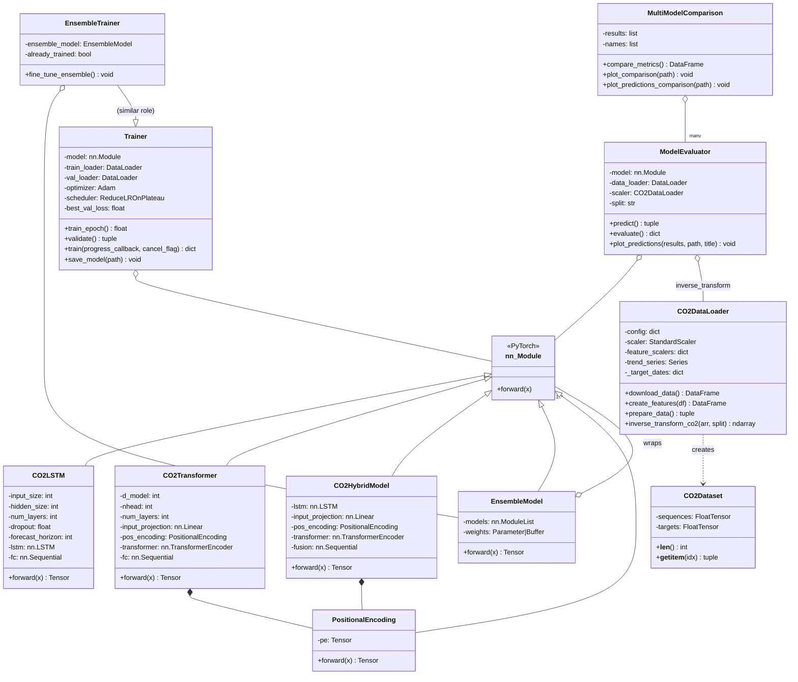
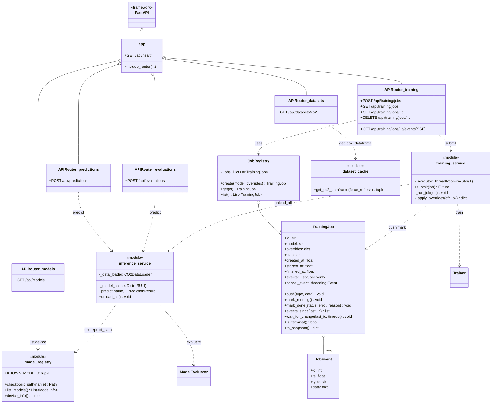
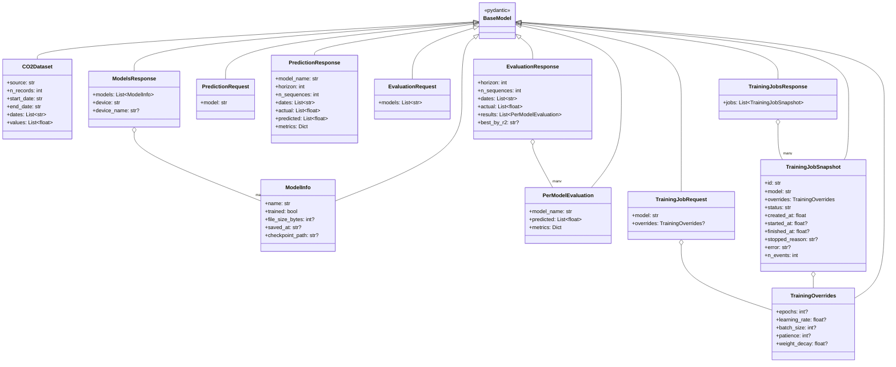
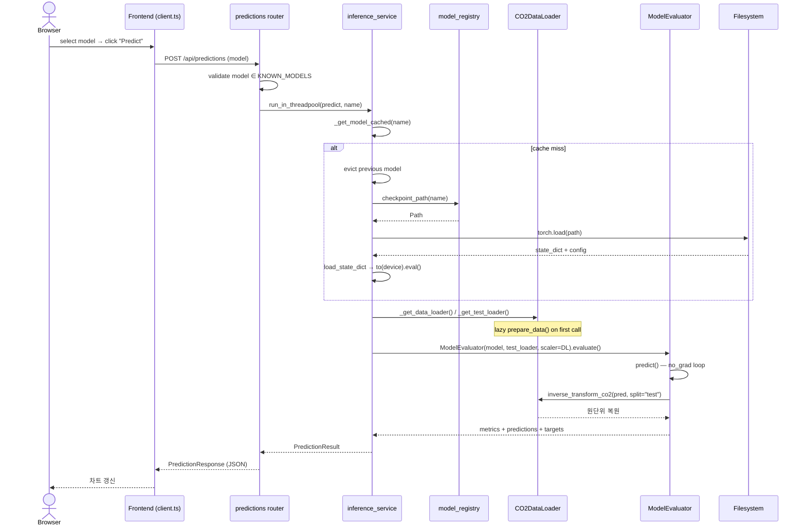
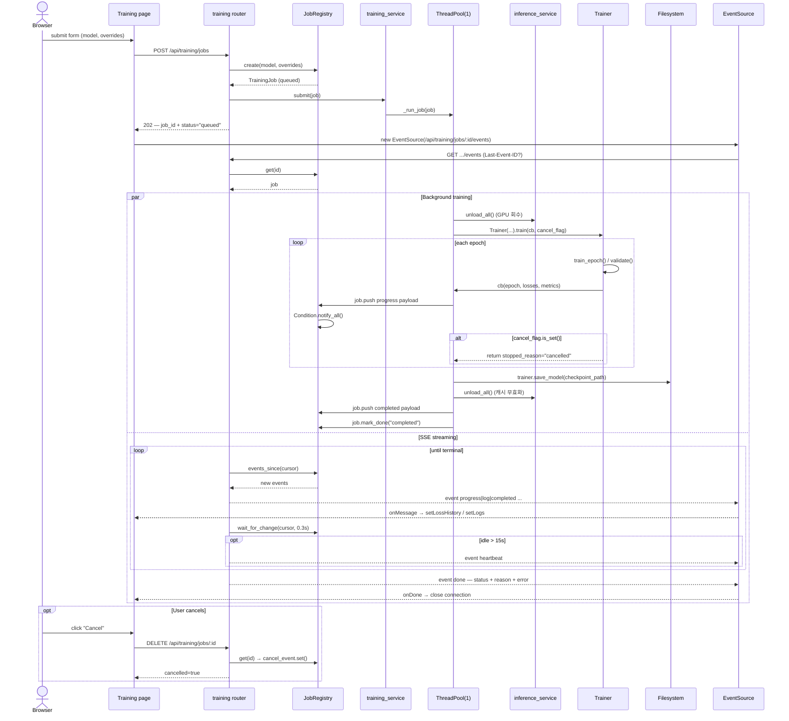
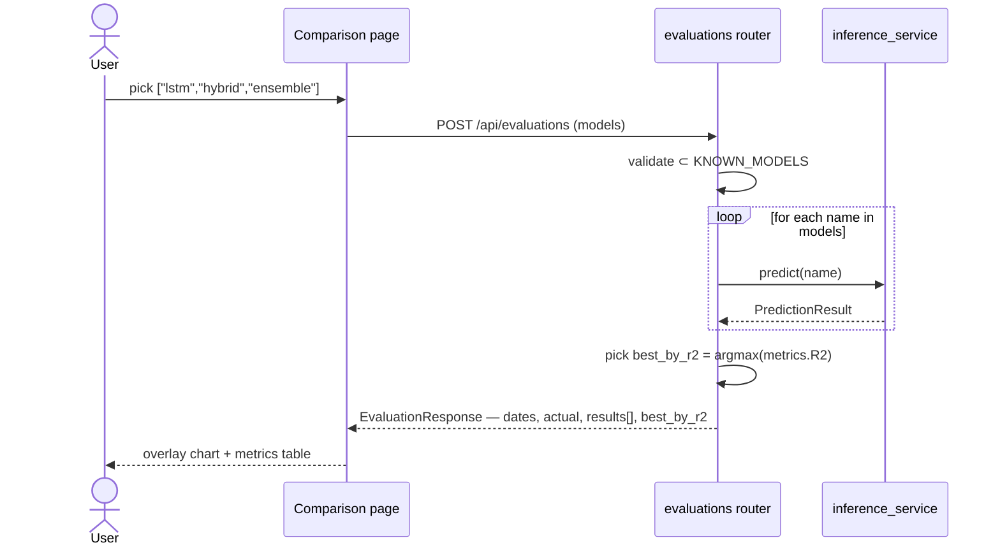
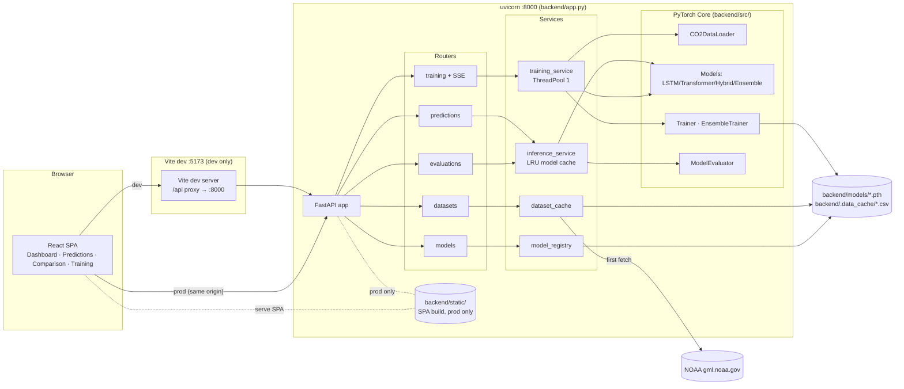
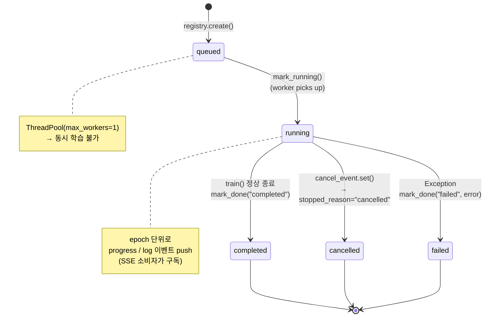
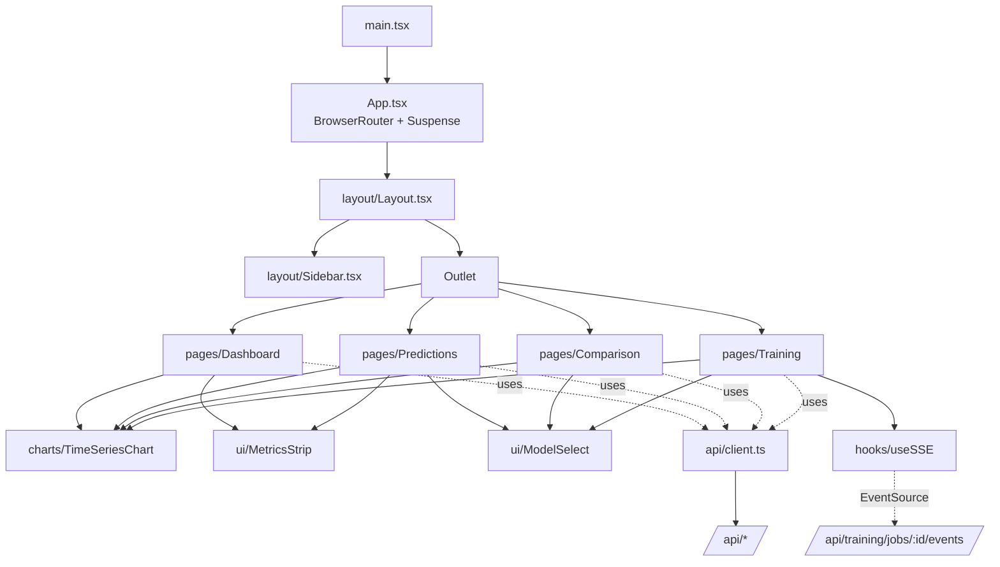

# CO2 Forecast — UML 다이어그램

Mermaid 문법으로 작성된 UML 다이어그램 모음입니다. GitHub/GitLab/VSCode Markdown Preview에서 바로 렌더링됩니다.

---

## 1. 클래스 다이어그램 — Core (PyTorch 모델 & 학습)

---

## 2. 클래스 다이어그램 — API / Service 계층

---

## 3. 클래스 다이어그램 — Pydantic I/O 스키마

---

## 4. 시퀀스 다이어그램 — 추론 (`POST /api/predictions`)

---

## 5. 시퀀스 다이어그램 — 학습 + SSE (`POST /api/training/jobs`)

---

## 6. 시퀀스 다이어그램 — 다모델 비교 (`POST /api/evaluations`)

---

## 7. 컴포넌트 다이어그램 (배포 관점)

---

## 8. 상태 다이어그램 — TrainingJob

---

## 9. 프론트엔드 라우트 / 컴포넌트

